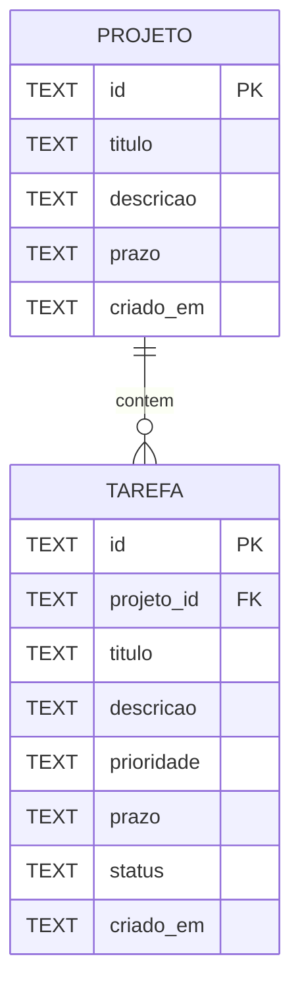

# Modelo relacional do DevTrack

## Diagrama entidade-relacionamento

Um projeto pode existir sem tarefas ou conter várias. Toda tarefa pertence a exatamente um projeto. A chave estrangeira impede tarefa órfã; a exclusão em cascata representa a regra de remoção do agregado.

## Dicionário de dados

| Tabela.campo | Tipo | Regra | Descrição |
|---|---|---|---|
| projeto.id | TEXT | PK, não nulo | Identificador estável |
| projeto.titulo | TEXT | não vazio | Nome do projeto |
| projeto.descricao | TEXT | opcional | Contexto do projeto |
| projeto.prazo | TEXT | data ISO opcional | Prazo final |
| projeto.criado_em | TEXT | ISO-8601 | Data de criação |
| tarefa.id | TEXT | PK, não nulo | Identificador estável |
| tarefa.projeto_id | TEXT | FK, não nulo | Projeto proprietário |
| tarefa.titulo | TEXT | não vazio | Nome da tarefa |
| tarefa.descricao | TEXT | opcional | Detalhes da tarefa |
| tarefa.prioridade | TEXT | baixa, media ou alta | Nível de prioridade |
| tarefa.prazo | TEXT | data ISO opcional | Data limite |
| tarefa.status | TEXT | pendente, em andamento ou concluida | Estado atual |
| tarefa.criado_em | TEXT | ISO-8601 | Data de criação |

## Dependências e normalização

- `projeto.id -> titulo, descricao, prazo, criado_em`.
- `tarefa.id -> projeto_id, titulo, descricao, prioridade, prazo, status, criado_em`.
- 1FN: cada campo armazena um valor atômico; tarefas não são listas dentro de projetos.
- 2FN: as duas tabelas usam chave primária simples; cada atributo não-chave depende da chave inteira.
- 3FN: dados descritivos do projeto ficam em `projeto`; a tarefa guarda apenas a chave estrangeira, evitando repetir título e prazo do projeto.

## Decisões

IDs são texto para aceitar UUIDs gerados pelo cliente ou servidor. Datas são armazenadas no formato ISO-8601 para ordenação consistente. O SQL correspondente está em `database/schema.sql` e é uma entrega de modelagem; o MVP web usa IndexedDB, não se conecta a um servidor SQL.