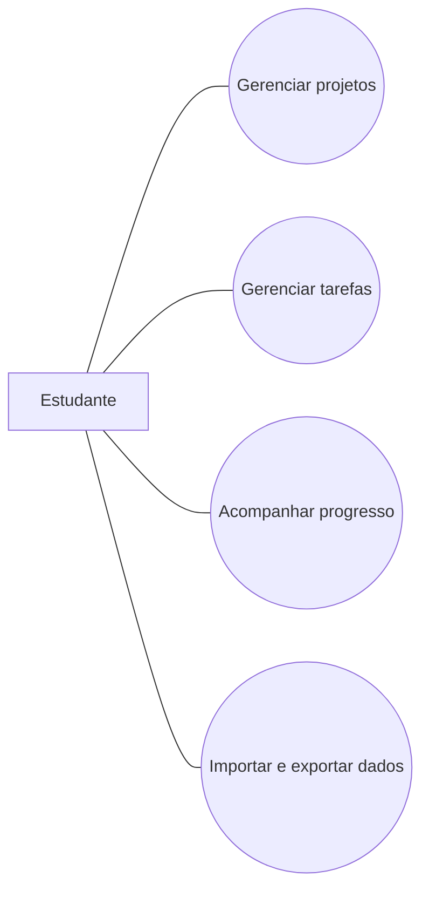
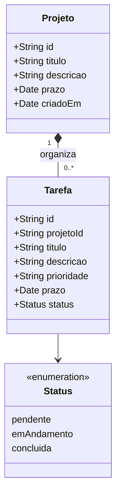
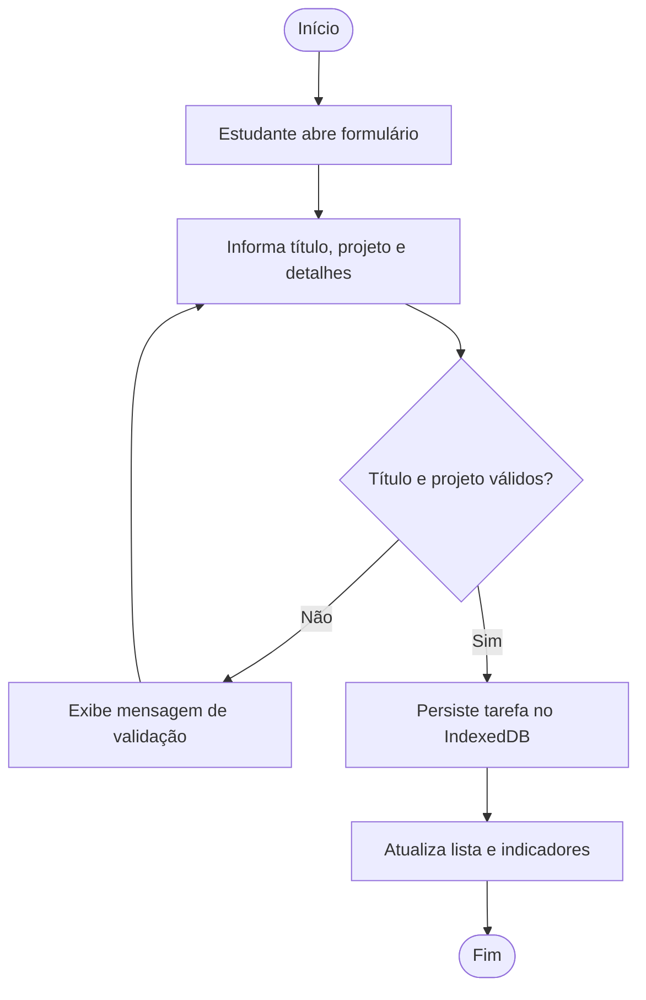

# UML do DevTrack

## Casos de uso

## Classes conceituais

## Atividade: cadastrar tarefa

## Ligação com a implementação

`Projeto` e `Tarefa` são registros persistidos em stores separados, relacionados por `projetoId`. O diagrama descreve o domínio; a implementação divide acesso a dados, validação e renderização em módulos JavaScript.